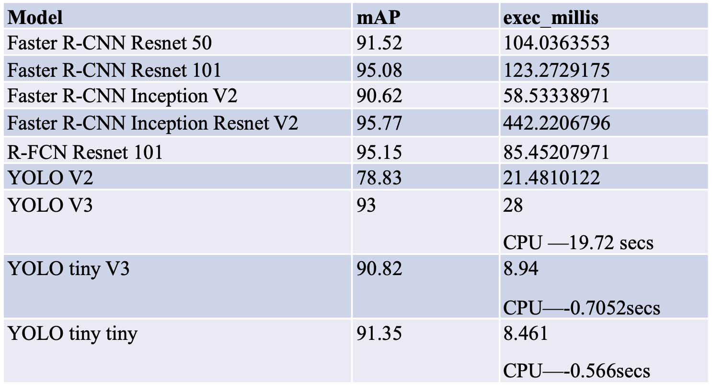

# Masterpraktikum 2019 -- Using object detection on GTSDB dataset 

This result shows that the complexity of small models like YOLO tiny V3 is sufficient for traffic sign detection. In contrast to the Microsoft COCO dataset with 80 classes of many different objects, the traffic signs of GTSDB only have simple shapes such as circle, triangle and simple colors like blue, red and black. The model doesn’t need so many layers for feature extraction and only need to classify the simple contours and colors. 

# Method

In order to optimize the efficiency, I cut four layers of YOLO tiny V3 making the model slimmer and called it YOLO tiny tiny. In addition to cutting layers, I enlarged input images as well because we prefer to recognize the traffic sign as far as possible and bigger images enhance the detection of the small object which is also confirmed in Álvaro Arcos García’s paper.

# Dataset 

Download the dataset and the corresponding weights by me google drive https://drive.google.com/open?id=176XhrGdofwgOuHx2Klj1_h3xe645AHGK and save on your google drive as tiny then open the Colab notebook and mount your google drive. 
